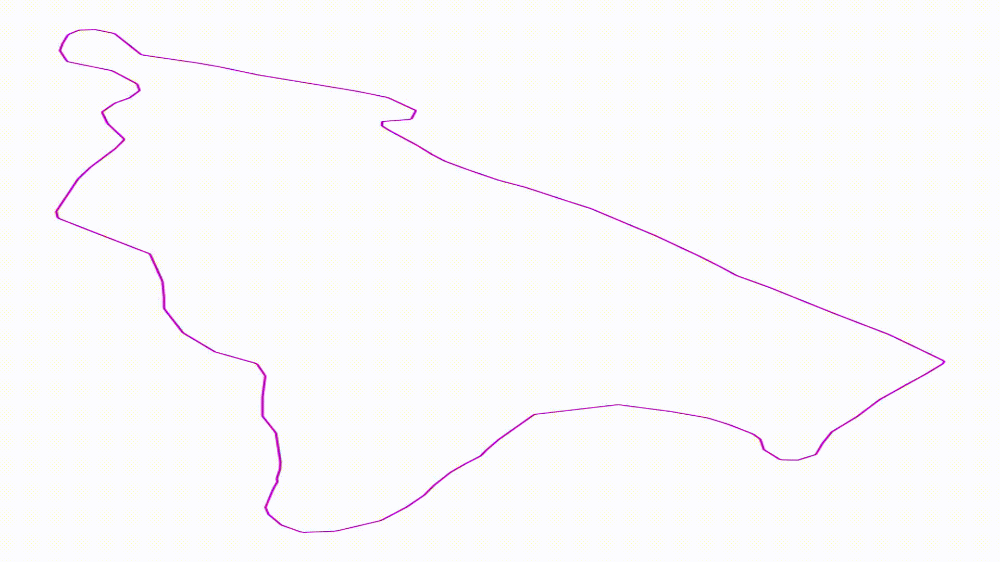
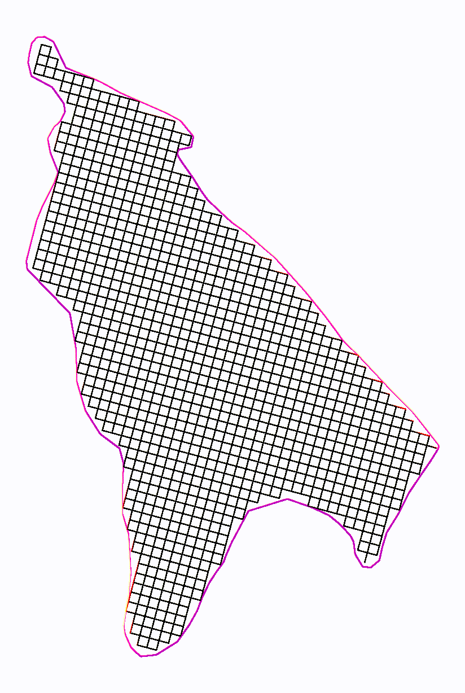
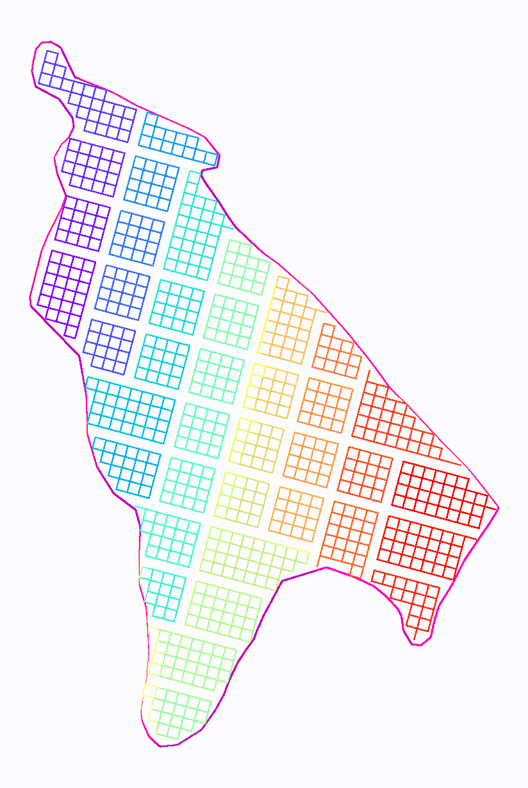
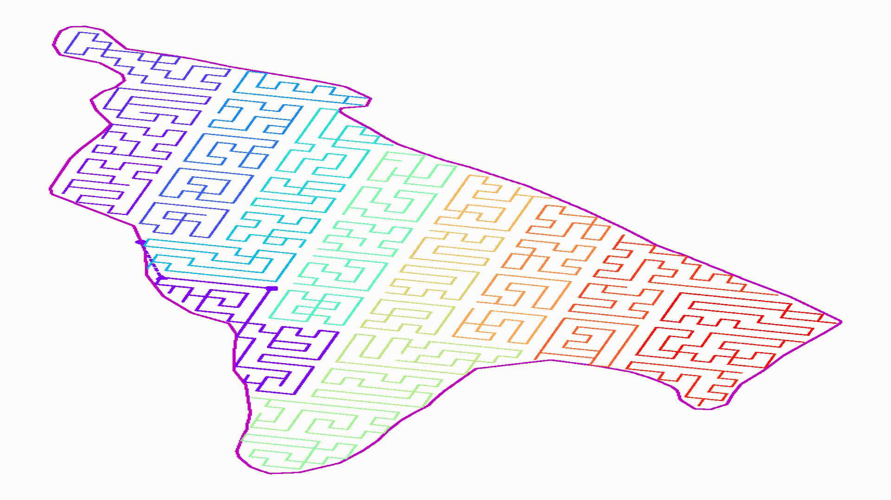
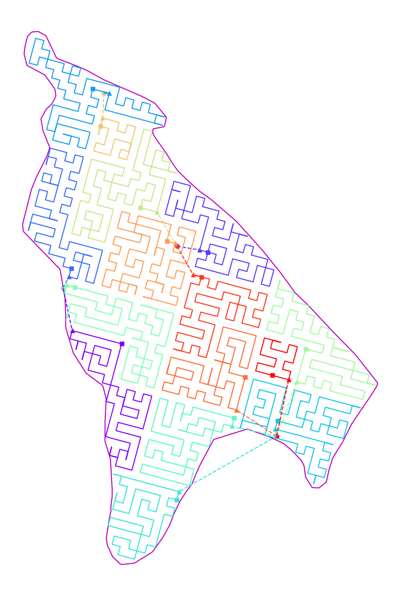

.. wadl documentation master file, created by
   sphinx-quickstart on Sun Oct 18 15:40:47 2020.
   You can adapt this file completely to your liking, but it should at least
   contain the root `toctree` directive.

Coverage Path Planner
========================

``wadl`` is a python package for planning surveys over large areas using one or more UAV (Unpiloted Aerial Vehicle). WADL take in a geofence and desired gird spacing and produces a series of routes to survey the area inside the geofence. 

``wadl`` is licensed under GPL v3. More information can be found in the :ref:`license` section.

Motivation
----------

The project was motivated by the need for efficient route planning for multi-robot systems. WADL was designed and used in a 2019-2020 survey of Adélie penguins over `Cape Crozier`_, Ross Island, Antarctica.

.. _Cape Crozier: https://goo.gl/maps/wrMTuMq5kyNxZafx8) 

If you are interested in the technical details please see our paper <> 

Overview
--------
``wadl`` works by taking in a geofence and a desired lattice spacing to overlay a grid on the geofenced region. This is the geofence of the Cape Cozier Adélie penguin rookery. 

..    <iframe width="300" height="490" src=_static/videos/grid.mp4 frameborder="0" allow="autoplay; </iframe>

It will then split this grid into smaller isolated sub-grid.

For each of these sub-grids it will find a cyclical path through the grid such that each point on the sub-grid is visited at least once. 

Finally it will link together these smaller paths into a bigger path. An optional "home" point can be added. The final length can be adjusted by setting a flight time limit.  

The final set of paths are exported as a csv file and can be imported into other flight control software. We provide tools to export routes to UGCS_.

.. _UGCS: (https://www.ugcs.com/)

Citing
------

To cite wadl please use the following publication:

.. only:: html

   `PDF <.pdf>`

================================

.. toctree::
   :maxdepth: 2
   :caption: Contents:
   
   install
   tutorial
   reference/index
   license

Indices and tables
==================

* :ref:`genindex`
* :ref:`modindex`
