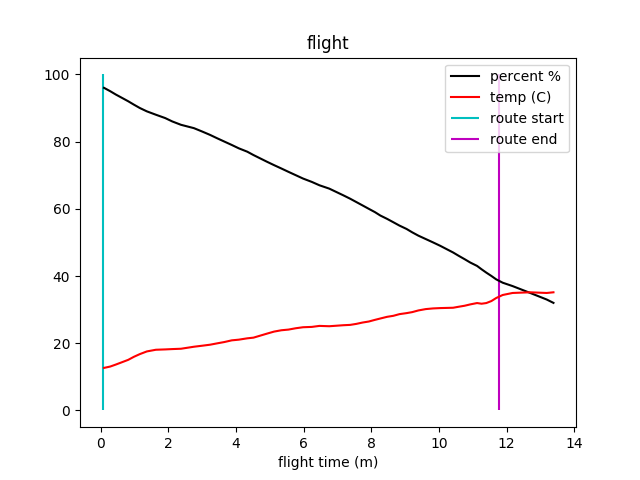
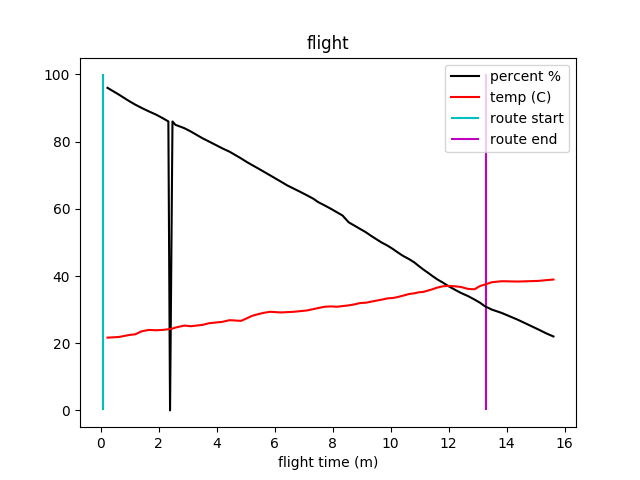

# Mission 11-25
## Test Flights over C,P,N,B (Zones 3 and 0)
### Mission Goal
Test 2 drones flying from the Hut to the colonies, landing at Penguin Pass and Pat's Peak. Next flight would test 2 drones taking off from the field doing to the colonies and then back home. 

### Results 
1 drone (waddle 3) completed all tests, modulo a static altitude error (see notes). Waddle 4 did not fly

### Pilots: KS, AS
### VO: GB, PL, VM

## Tasks
- Test connectivity to the hut from Pat's Peak.
- Test endurance from hut to colony. 
- Test auto land from long distance. 

## Flights
### 1
- Drone: Waddle 3
- Pilot: KS
- Route: z3-0
- Path: Hut -> zone 3 -> Pats Peak

### 2
- Drone: Waddle 3
- Pilot: AS
- Route: z0-0
- Path: Pats Peak -> zone 0 -> Hut

## Notes
- Waddle 4 controller had an error forcing recalibration, upon recalibration large fog entered the flight zone. All waddle 4 flights were scrubbed. 
- Altitude was set relative to the home point, which was 100m up resulting in flights that were much higher than expected. 